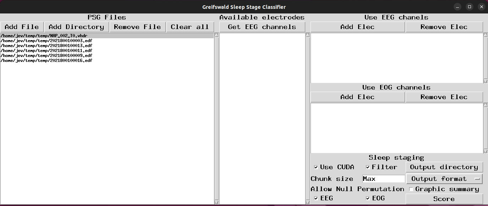
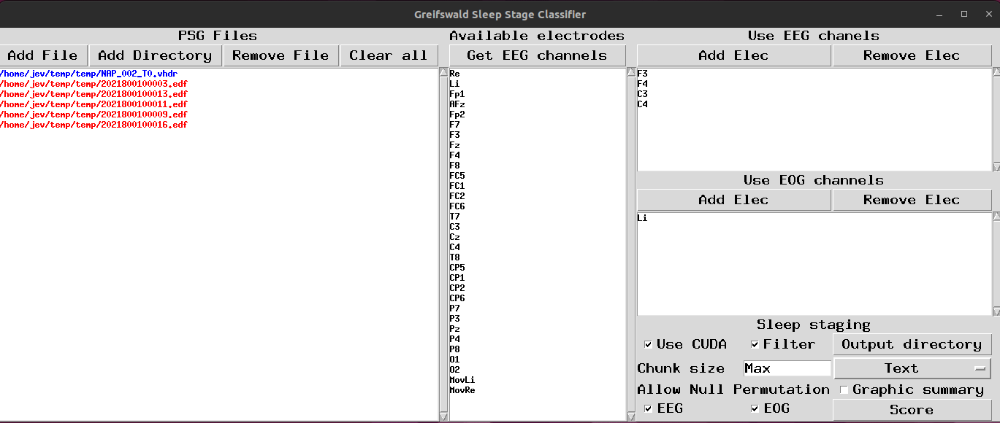
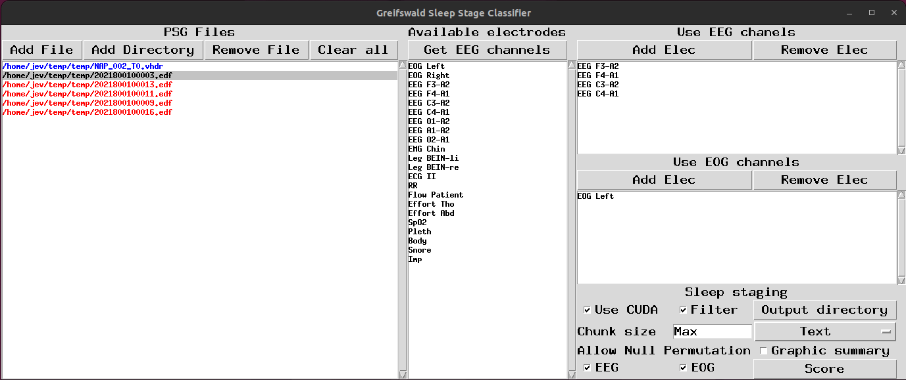

Greifswald Sleep Stage Classifier GUI
=====================================

## Introduction
The Graphical User Interface (GUI) for the GSSC offers users the possibility to perform sleep staging with in a relatively simple, point-and-click environment. It is also easy to run on large batches automatically.

## Step 1: Specify the files
The left-most window is dedicated to specifying the EEG files you want to run sleep-staging on. You can do this either by selecting individual files, or you can select an entire directory. In the picture here we have selected a directory containing several files, the first of which is from a different dataset than the others.

## Step 2: Load channels
If we select a file in the left-most window and then click the "Get EEG channels" at the top of the central section, then the central window will be populated with all the EEG channels found within the file.

## Step 3: Select channels for inference.
From the populated channel list in the central section, we select the EEG and/or EOG channels we want to use to infer the sleep stages. After selecting the EEG channels we want, we click the "Add Elec" button in the top-right section. If desired repeat this process for the EOG section directly below.

## Step 4: Sleep staging
In the bottom right corner, we can specify parameters for inference.

**Use CUDA:** Make use of CUDA acceleration. This will be auto-selected if your computer is capable of it. If not, it will be disabled by default.
**Filter:** Filters the data with a bandpass 0.3-30Hz, which is the band the GSSC was trained on. Do not uncheck unless you are certain your data are already filtered to this band.
**Chunk size:** This is useful if your CUDA-capable GPU does not have enough memory to do a whole file at once. If you get out-of-memory errors, try setting this to 500, or less if you still get errors.
**Allow Null Permutation:** The GSSC will try different permutations of EEG/EOG channels from the set of channels you selected previously. A null EEG permutation is one where no EEG channel is used at all (i.e. EOG only), or the reverse with null EOG. If you deselect these, these null permutations will not be allowed.
**Output directory:** Optional. Output will go in the specified directory. If unspecified, the results will go in the same directory as the EEG files.
**Output format:** Mandatory. Options are MNE-Python annotation files, or comma-delimited text files (.csv)
**Graphic summary:** If selected, this will produce a graphic summary of the results for each file. These are saved as .png files wherever the output goes.
**Score:** This actually runs the inference. Give it some time, especially if you have a lot of files in the left window, or do not have CUDA acceleration. Note: when you click this button inference will run on **every** file in the left window, not just the one you clicked for electrode selection.

## Failed staging
When you click "Score," sleep staging will be attempted on **every** file in the left window. Afterwards, every file which was scored succesfully will be printed in blue. Failed files on the other hand will marked in red. The picture below shows a case where the first file - the one we selected the electrodes from earlier - succeeded, but every subsequent one failed.

In this case, the failure happened because the first file is from a different dataset than the others, and has different electrode names. We can fix this simply by picking another file in the left window, repeating steps 2 and 3 with the appropriate channel names.

After fixing the channels, run "score" again. The already blue files will be skipped. You can repeat this process as necessary until every file is blue. 
